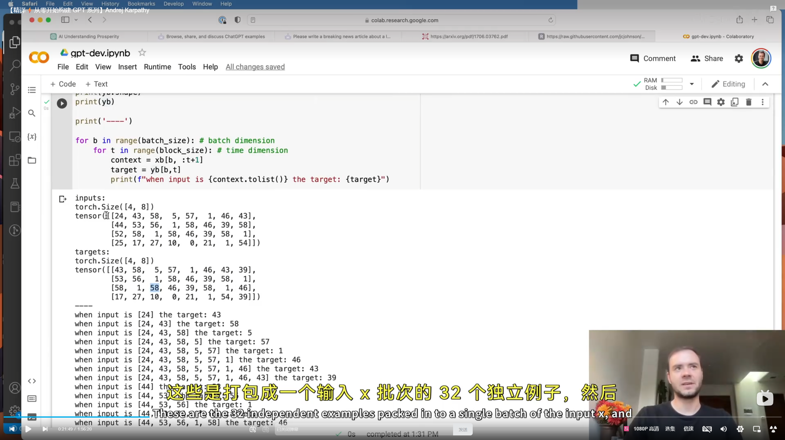

``` python
import torch
import torch.nn as nn
from torch.nn import functional as F

# -------------------- Part 1: 超参数 & 设置 --------------------
batch_size = 4      # 批次大小
block_size = 8      # 上下文长度 (序列最大长度)
max_iters = 5000    # 总训练迭代次数
eval_interval = 500 # 评估间隔
learning_rate = 1e-3# 学习率
device = 'cuda' if torch.cuda.is_available() else 'cpu' # 设备
eval_iters = 200    # 用于评估损失的迭代次数
n_embd = 32         # 嵌入维度 (d_model)
# -------------------------------------------------------------------------

torch.manual_seed(1337) # 固定随机种子

# -------------------- Part 2: 数据准备与分词 --------------------
# 提示: 请在脚本同目录下创建一个名为 'input.txt' 的文件，并填入一些文本。
try:
    with open('input.txt', 'r', encoding='utf-8') as f:
        text = f.read()
except FileNotFoundError:
    print("错误: 'input.txt' 文件未找到。将使用默认文本。")
    text = "hello world, this is a test for the simple gpt model."

chars = sorted(list(set(text)))
vocab_size = len(chars)

stoi = { ch:i for i,ch in enumerate(chars) }
itos = { i:ch for i,ch in enumerate(chars) }
encode = lambda s: [stoi[c] for c in s]
decode = lambda l: ''.join([itos[i] for i in l])

data = torch.tensor(encode(text), dtype=torch.long)
n = int(0.9*len(data))
train_data = data[:n]
val_data = data[n:]
# -------------------------------------------------------------------------

# -------------------- Part 3: 数据加载器 --------------------
def get_batch(split):
    data = train_data if split == 'train' else val_data
    ix = torch.randint(len(data) - block_size, (batch_size,))
    x = torch.stack([data[i:i+block_size] for i in ix])
    y = torch.stack([data[i+1:i+block_size+1] for i in ix])
    x, y = x.to(device), y.to(device)
    return x, y
# -------------------------------------------------------------------------

# -------------------- Part 4: 损失评估函数 --------------------
@torch.no_grad()
def estimate_loss():
    out = {}
    model.eval()
    for split in ['train', 'val']:
        losses = torch.zeros(eval_iters)
        for k in range(eval_iters):
            X, Y = get_batch(split)
            logits, loss = model(X, Y)
            losses[k] = loss.item()
        out[split] = losses.mean()
    model.train()
    return out
# -------------------------------------------------------------------------

# -------------------- Part 5: 模型定义 --------------------

# --- Part 5A: 单个自注意力头模块 (Single Attention Head) ---
class Head(nn.Module):
    """ one head of self-attention """

    def __init__(self, head_size):
        super().__init__()
        # 线性变换层，用于生成 Key, Query, Value
        self.key = nn.Linear(n_embd, head_size, bias=False)
        self.query = nn.Linear(n_embd, head_size, bias=False)
        self.value = nn.Linear(n_embd, head_size, bias=False)
        # 注册一个不可训练的下三角矩阵作为 buffer
        self.register_buffer('tril', torch.tril(torch.ones(block_size, block_size)))

    def forward(self, x):
        B,T,C = x.shape
        # 1. 输入 x 分别经过线性变换得到 q, k, v
        k = self.key(x)   # (B,T,head_size)
        q = self.query(x) # (B,T,head_size)

        # 2. 计算注意力分数 ("affinities")
        # (B, T, head_size) @ (B, head_size, T) -> (B, T, T)
        wei = q @ k.transpose(-2,-1) * C**-0.5 # C 就是 n_embd
        # 3. 应用因果掩码
        wei = wei.masked_fill(self.tril[:T, :T] == 0, float('-inf')) # (B, T, T)
        # 4. 应用 Softmax 得到权重
        wei = F.softmax(wei, dim=-1) # (B, T, T)
        
        # 5. 对 Value 进行加权求和
        v = self.value(x) # (B,T,head_size)
        out = wei @ v # (B, T, T) @ (B, T, head_size) -> (B, T, head_size)
        return out

# --- Part 5B: 完整的语言模型 (The Full Language Model) ---
class LanguageModel(nn.Module):

    def __init__(self):
        super().__init__()
        self.token_embedding_table = nn.Embedding(vocab_size, n_embd)
        self.position_embedding_table = nn.Embedding(block_size, n_embd)
        # 植入一个自注意力头
        self.sa_head = Head(n_embd)
        # 最终的预测层
        self.lm_head = nn.Linear(n_embd, vocab_size)

    def forward(self, idx, targets=None):
        B, T = idx.shape

        # 1. 获取内容和位置向量
        tok_emb = self.token_embedding_table(idx) # (B,T,C)
        pos_emb = self.position_embedding_table(torch.arange(T, device=device)) # (T,C)
        # 2. 融合信息
        x = tok_emb + pos_emb # (B,T,C)
        # 3. !! 将融合后的信息送入自注意力头进行“思考” !!
        x = self.sa_head(x) # (B,T,C)
        # 4. 经过最终层得到预测 logits
        logits = self.lm_head(x) # (B,T,vocab_size)

        if targets is None:
            loss = None
        else:
            B, T, C = logits.shape
            logits = logits.view(B*T, C)
            targets = targets.view(B*T)
            loss = F.cross_entropy(logits, targets)

        return logits, loss

    def generate(self, idx, max_new_tokens):
        for _ in range(max_new_tokens):
            idx_cond = idx[:, -block_size:]
            logits, loss = self(idx_cond)
            logits = logits[:, -1, :]
            probs = F.softmax(logits, dim=-1)
            idx_next = torch.multinomial(probs, num_samples=1)
            idx = torch.cat((idx, idx_next), dim=1)
        return idx
# -------------------------------------------------------------------------

# -------------------- Part 6: 训练 --------------------
model = LanguageModel()
m = model.to(device)
print(f"模型总参数量: {sum(p.numel() for p in m.parameters())/1e6:.6f} M")

optimizer = torch.optim.AdamW(m.parameters(), lr=learning_rate)

print(f"\n开始在 {device} 上训练...")
for iter in range(max_iters):
    if iter % eval_interval == 0 or iter == max_iters - 1:
        losses = estimate_loss()
        print(f"第 {iter} 步: 训练集损失 {losses['train']:.4f}, 验证集损失 {losses['val']:.4f}")

    xb, yb = get_batch('train')
    logits, loss = m(xb, yb)
    optimizer.zero_grad(set_to_none=True)
    loss.backward()
    optimizer.step()
# -------------------------------------------------------------------------

# -------------------- Part 7: 生成 --------------------
print("\n--- 训练完成，开始生成文本 ---")
context = torch.zeros((1, 1), dtype=torch.long, device=device)
generated_text = decode(m.generate(idx=context, max_new_tokens=500)[0].tolist())
print(generated_text)
# -------------------------------------------------------------------------
```
